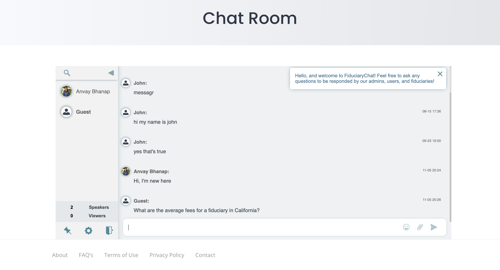
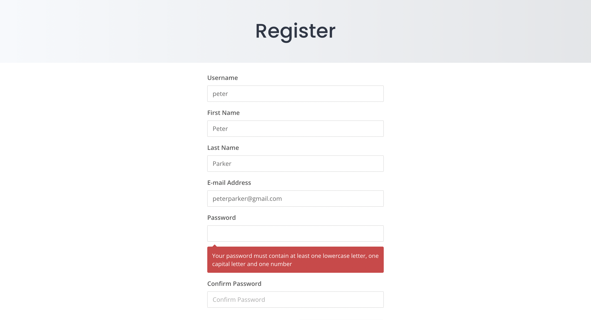
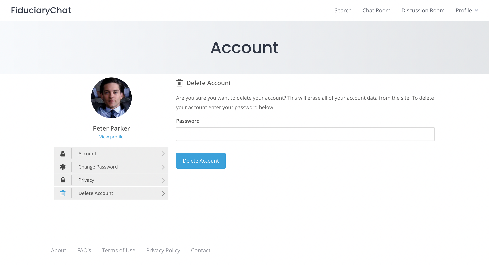
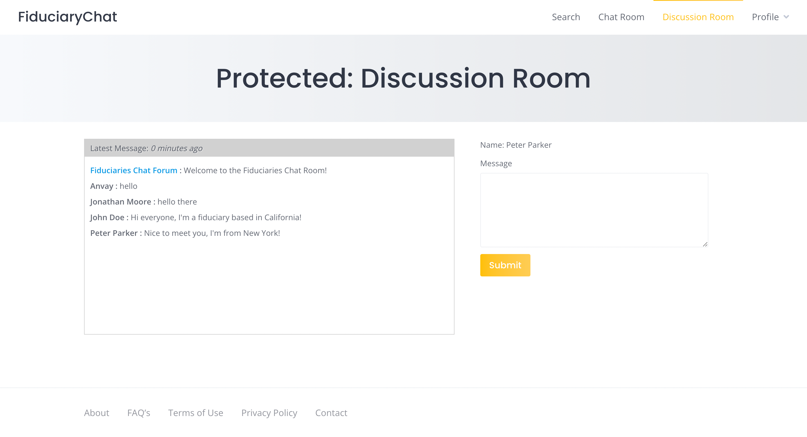

# FiduciaryChat
FiduciaryChat is a project I worked on as a freelance developer from May to August 2023. The project aimed to establish a centralized platform for the U.S. financial advisory industry, facilitating their engagement with potential clients and fostering connections among trust management professionals. Unfortunately, the project was discontinued due to resource constraints and shifting priorities. But I still wanted to showcase my work over the summer so I created a comprehensive walkthrough that highlights every aspect of the website and demonstrates the user's journey through its interface.

If the website is still live when you read this, feel free to explore it firsthand by clicking this link: [FiduciaryChat](https://testsite333dev.wpengine.com)

[← Back to my GitHub](https://github.com/AnvayB/FiduciaryChat/)

## Homepage

1. This is the homepage that potential users or people interested in finding a financial advisor would be able to see and interact with.
2. As this is an invite-only website, interested financial advisors would have to submit their LinkedIn profile and email address to be considered for entry.
3. Standard users would be able to access the options available in the Navigation bar immediately.

## Search

1. The Search page offers a complete directory of all the financial advisors registered to the website.
2. People can search for a financial planner by name through the Search bar or use the additional filters below that specify the Services Provided and the Licensed-in-state.

   
   

 

 

## Chat Room

1. They can also access the Chat Room which can be used to ask questions and interact with any live users of the website.
2. Users can log in with their Username, or Facebook or Twitter profiles, or just talk as a Guest.
3. Responses would be provided by fellow users, financial advisors, or the website admin.

   
   

## Login

1. A pre-existing user would be able to access their account through Login, and a financial advisor that’s been approved would be able to register from the button below. I’ll create a sample user here.

## Register

1. The registration page contains the typical input fields – Username, First Name, Last Name, Email, Password (and Confirm Password).
2. The Confirm Password field becomes red if the passwords don’t match.
3. Also ensures password complexity by checking that the entry contains at least 1 lowercase letter, 1 uppercase letter, and 1 number.

   
   

## Profile

1. After that’s entered, the user will land on this blank Profile page, to which they can add content by clicking the Settings gear icon and selecting “Edit Profile”.
2. Here, the user can add all their relevant and esteemed information, as well as if they were referred by another advisor, which serves to increase their reputability.

3. The Introduction text box has additionally been provided with an example message for the financial advisors to advertise themselves to potential clients. They are free to edit the message as they want or write their own.
4. Because this site is primarily geared toward fiduciaries (hence the name), a secret password is shown if the user selects “Fiduciaries” as one of the Services Provided.
   * This password grants them access to the “Discussion Room” section, which was added to the NavBar after logging in.
   * Using this, they can communicate with other certified fiduciaries to ask questions and network.

   
   

   
5. Once the user has completed filling out their Profile, they can press the Update Profile button and view their entire About page.
   * Naturally, the fiduciaries' password is private, so it isn’t displayed on their public profile.

6. The user can adjust further account settings by clicking on the Settings gear icon and selecting “My Account”
   * This allows them to edit this Account details, change their password, hide their profile from the directory (if needed), and delete their account

   
   

   
   

## Discussion Room

1. Verified fiduciaries can navigate to the Discussion Room page from the NavBar and are met with this password-protected page, wherein they can input their password and gain access to the Fiduciaries-only discussion room.
2. Messages sent here will be visible to all registered fiduciaries on the website.

   
   

## New Homepage

1. Finally, logged-in users no longer see the original homepage, as the promotional page is irrelevant to them.
2. Instead, when the user clicks on the FiduciaryChat button at the top left, they are seamlessly guided to the Search page, as that is what they will be using to find other financial advisors and communicate with them.

## Logout

1. Once the financial advisor is finished using the website, they can choose to log out by hovering on the Profile dropdown in the top right corner and selecting “Logout”.
2. This will redirect them back to the original homepage that everyone sees when they first open the FiduciaryChat website.

### Plugins Used
* [Akismet Anti-Spam: Spam Protection](https://wordpress.org/plugins/akismet/) v5.1
* [Different Home for Logged IN & Logged OUT](https://wordpress.org/plugins/different-home-for-logged-in-logged-out/) v1.3.0
* [Easy Accordion](https://wordpress.org/plugins/easy-accordion-free/) v2.2.3 
* [Elementor](https://wordpress.org/plugins/elementor/) v3.14.1
* [Genesis Blocks Pro](https://wordpress.org/plugins/genesis-blocks/) v2.0.0
* [Genesis Site Starter](https://wpengine.com/support/get-started-genesis-studiopress-theme/) v1.1.0
* [RumbleTalk Chat](https://wordpress.org/plugins/rumbletalk-chat-a-chat-with-themes/) v6.1.7
* [Simple Ajax Chat](https://wordpress.org/plugins/simple-ajax-chat/) v20230722
* [Ultimate Member](https://wordpress.org/plugins/ultimate-member/) v2.6.11
* [WPForms Lite](https://wordpress.org/plugins/wpforms-lite/) v1.8.2.2

### Languages/Tools Used
 
 
 

[Back to Top](https://anvayb.github.io/FiduciaryChat/#fiduciarychat
)